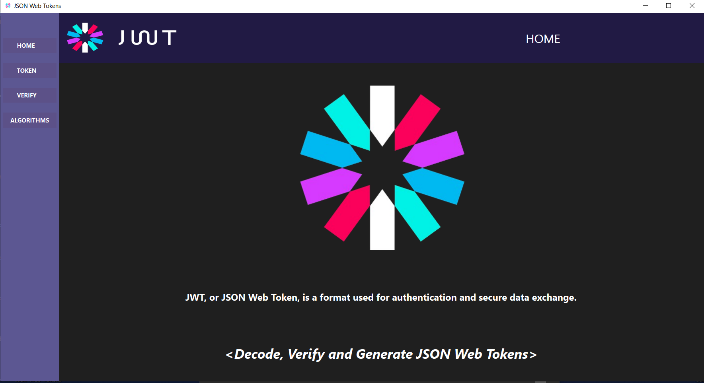
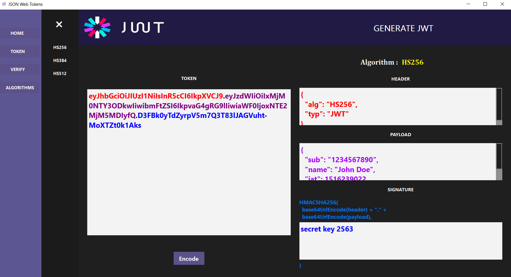
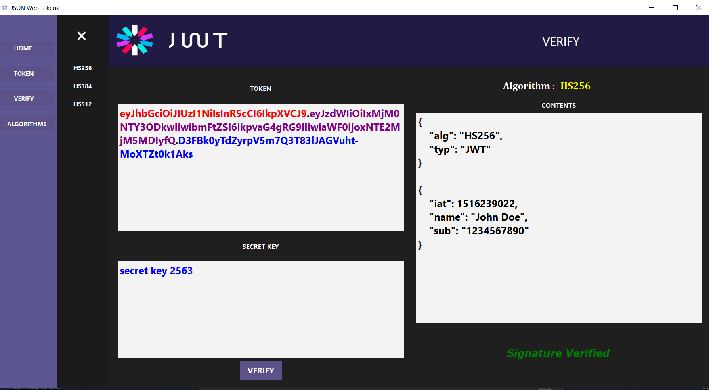

# JWT Desktop Application

<p align="center">
  
</p>


## Overview
JSON Web Tokens (JWTs) are an open, industry-standard method for representing claims securely between two parties. They are commonly used for authentication and information exchange in web applications. By using JWTs, developers can create stateless authentication systems, enabling users to log in once and maintain their session without the need for a server-side session store.

## About the Application
This desktop application, **Json-Web-Tokens**, is inspired by the JWT website [jwt.io](https://jwt.io/), which provides tools for decoding, verifying, and generating JWTs. Our application offers a user-friendly interface that simplifies the process of managing JWTs, allowing developers to generate tokens with customizable claims and validate existing tokens easily.

## Features
- Simple and intuitive interface built using the Qt framework.
- Generate JWTs with various claims and customizable payloads.
- Validate existing JWTs to ensure their integrity and authenticity.
- Supports the HS256, HS384 and HS512 algorithms.

### Home interface : 
<p align="center">
  
</p>

### JWT generation interface : 

<p align="center">
  
</p>

### Verification interface :

<p align="center">
  
</p>


## Requirements
- Windows operating system
- Qt 6.7.2 or compatible version
- MinGW compiler (if building from source)

## Installation
1. Clone the repository:
   ```bash
   git clone https://github.com/Youssef-Daouayry/JWT-Desktop-Application.git
2. If you have Qt Creator installed, open the project file (Json-Web-Tokens.pro) and build the project.

3. Alternatively, if you do not have Qt Creator, you can execute the pre-built file ```Json-Web-Tokens.exe``` located in the ```bin``` folder:

4. Ensure all necessary DLL files from the release folder are included in the same directory as the executable.

